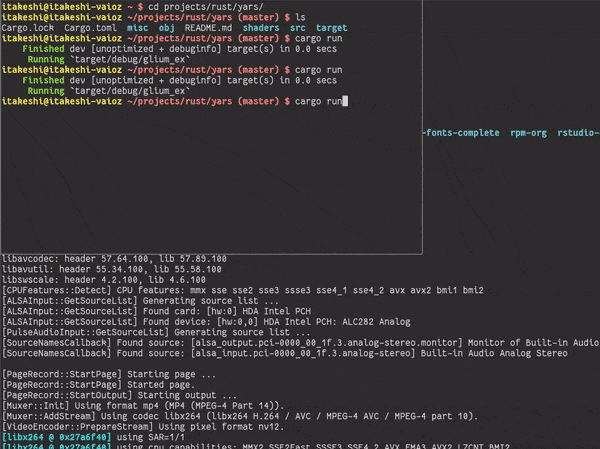

YA.RS
=====
Yet Another Robotics Simulator written in Rust

This isn't intended for a practical software nor library, but just for my own training to:

* become familiar with Rust,
* understand tha basics of OpenGL's shader programming model,
* and last but not least, learn fundamental mathematics underlying modern robotics.

## Current Status
Simple 2-link manipulator which is controllable according to the Lagrangian mechanics.

### How to try
After `git clone`, just execute `cargo run` in the root directory of the repository.
In-app key bindings are:

* `U` to add counter-clockwise torque to the first joint
* `I` to add clockwise torque to the first joint
* `J` to add counter-clockwise torque to the second joint
* `K` to add clockwise torque to the second joint
* `Q` to quit
